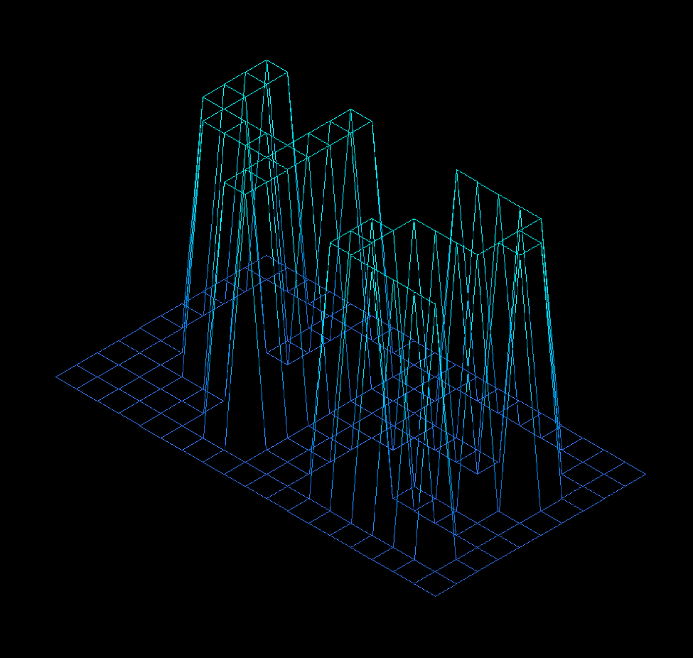

## FdF

## 🌄 FdF - Wireframe Landscape Renderer

**FdF (Fil de Fer)** is a project from [42 School](https://42.fr/) that introduces students to graphical programming and 3D wireframe rendering. The goal is to take a 2D map of elevations and render a 3D representation using isometric (or other) projections with MiniLibX.

---

## 🛠️ Features

- Parses `.fdf` elevation maps
- Renders 3D wireframe using:
  - Isometric projection (default)
  - Optional parallel projection
- Zoom, pan, and rotate the model in real-time
- Color gradients based on elevation
- User interaction with keyboard
- Clean, optimized C code with error handling

---

## 📸 Demo



> *Example of rendered 3D map in isometric view*

---

## 🚀 Run the Program

./fdf test_maps/<map>

---

## 🎮 Controls
```
Key                     Action

W/A/S/D           Move the camera
+ / -                   Zoom in/out
Arrow Keys              Rotate map
c                       switch to "Altitude view"          
ESC                   	Exit program
```
---

## 🗺️ Map File Format

A map is a plain text file.

Each number represents elevation.

Optionally, color can be added in hex format.

Example:
```
0 0 0 0
0 1 2 3
0 0 0 0 
```
With colors:
```
0 0 0 0
0,0xFFFFFF 1,0xFF0000 2,0x00FF00 3,0x0000FF
0 0 0 0
```
